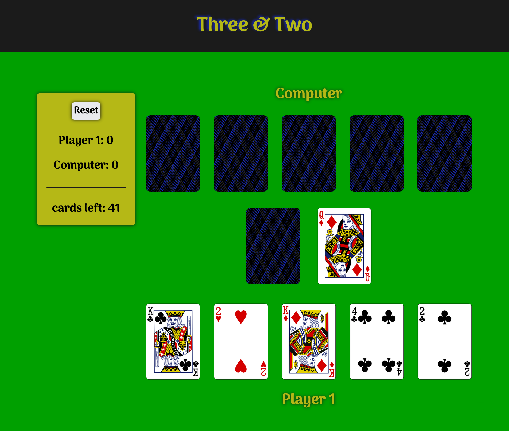

# Three and Two 🃗🃇🂥🂵🃅

A card game from my childhood. The goal is to collect two cards of the same number, and three cards of the same number. Find them? You won! But be fast, because the computer knows how to do it too 👀. Check it out 👉🏽 [here](https://bci1im.csb.app/)

## Technologies Used

* HTML
* CSS
* JavaScript
* Axios.js

## Approach Taken

I first started with setting up the API call and setting up the cards to be displayed on the page. Then, I moved on to getting down to the logic of the game. The player's functionality was worked out, mapping out the buttons and setting the correct calculations in place. After, it was time for the computer to become a worthy competitor! The logic for the computer to either take the card from the discard pile, or pick up a card from the draw pile was put in place. And then? Well, then we had a game, people! 🙌🏽💯

## Struggles

When I say that this game did _not_ want to cooperate? Boy, am I understating it 😅 First it was problems with the event listeners for the user's buttons, where I was setting them up, but trying to remove them before the computer's turn started. That.. did not work, of course. At first I was using 
s to display the cards, but then I wised up and switched them to buttons so that I could disable and re-enable them as I went. I did still have to rework the callback functions many times after that, in order to be able to remove the event listener once the game was over, however. Another thing I struggled with was having the game wait for the player to complete their turn before it moved on to the computer. I really had no idea how to make it do this, but after a lot of research I found a great StackOverflow answer online which instructed me to set up a promise that would be resolved after the player's last move. I also struggled with the computer's logic for to how to know when to keep the card or not. I was using an object to count the cards, and then turning it into an array to be able to use .forEach and find the index of the card to swap with. However, it took me a long time to figure out that the way I was creating that object, it was putting the cards in ascending order, and that was giving me the wrong index back. This was fixed by creating the object such that the card number was the key, and the value was another object with the count amount and the index number.

## Taking It Further

I would like to add these extra features to my app in the future:
- [ ] A modal with instructions on how to play the game at first launch
- [ ] Having a button that will let the user reshuffle the discard pile, if the pickup pile runs out before the game is over
- [ ] Dropping confetti when the user wins
- [ ] Making it playable as a two-player game
- [ ] Adding animations for the card flip/draw/discard
- [ ] Make it responsive and playable on mobile